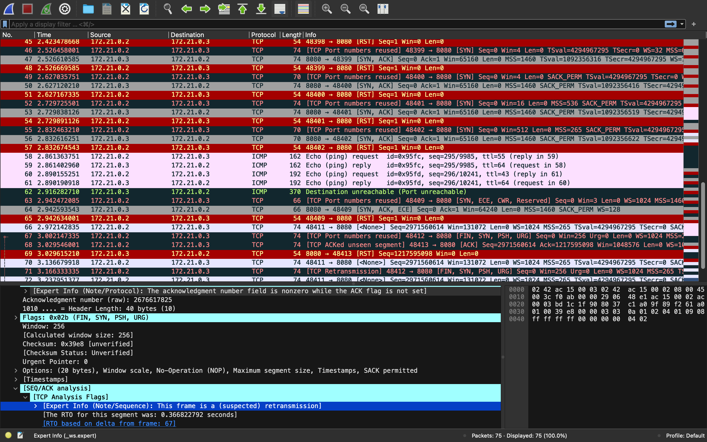

<div align="center">
  <h1>Сетевая безопасность</h1>
  <h3>Лабораторная работа №1</h3>
  <h4>Фадеев Артем, M34021</h4>
  <h4>Университет ИТМО, 2024</h4>
</div>  

---

### Тестовое окружение

Стоит немного рассказать про окружение, в котором я выполняю работу.

Сервер и клиент это контейнеры на базе ubuntu. Оба контейнера находятся в одной сети,
что позволяет использовать `nmap` и `tshark` для анализа сетевого трафика.

Все пакеты предварительно установлены в образе контейнера и готовы к использованию.

```Dockerfile
# server.dockerfile

FROM ubuntu:20.04

RUN apt-get update && \
    DEBIAN_FRONTEND=noninteractive apt-get install -y --no-install-recommends \
    nmap \
    tshark \
    apt-utils \
    net-tools \
    ufw \
    sudo \
    netcat \
    less \
    snort && \
    rm -rf /var/lib/apt/lists/*

COPY http /exec/http
RUN chmod +x /exec/http

RUN apt-get clean

ENTRYPOINT ["/exec/http"]
```

```Dockerfile
# client.dockerfile

FROM ubuntu:20.04

RUN apt-get update && \
    DEBIAN_FRONTEND=noninteractive apt-get install -y --no-install-recommends \
    nmap \
    net-tools \
    sudo \
    iputils-ping \
    telnet \
    curl && \
    rm -rf /var/lib/apt/lists/*

RUN apt-get clean
```

```yaml
version: '3.9'

services:
  client:
    container_name: network-security-client
    build:
      dockerfile: client.dockerfile
      context: .
    networks:
      - container-network
    tty: true
    cap_add:
      - NET_ADMIN
  server:
    container_name: network-security-server
    build:
      dockerfile: server.dockerfile
      context: .
    networks:
      - container-network
    cap_add:
      - NET_ADMIN
    tty: true
    volumes:
      - ./tshark:/tshark

networks:
  container-network:
    driver: bridge
```

### Подготовка окружения

Имеем `Makefile` для удобства.

```Makefile
COMPOSE_FILE = build/docker-compose.yml

server:
	@docker exec -it network-security-server /bin/bash

client:
	@docker exec -it network-security-client /bin/bash

run:
	@echo "Client and Server are running"
	@GOOS=linux GOARCH=amd64 go build -o ./build/http ./cmd/http.go
	@docker compose -f ${COMPOSE_FILE} up -d --build

clean:
	@echo "Client and Server are stopped"
	@docker compose -f ${COMPOSE_FILE} down
	@docker compose -f ${COMPOSE_FILE} rm -f

.PHONY: client server clean run stop build
```

Запускаем контейнеры:

```shell
make run
```

Далее открываем два окна терминала и подключаемся к контейнерам:

```shell
make server
```

```shell
make client
```

### Играемся с `nmap`

Для `nmap` нам необходимо узнать IP-адрес сервера:

```text
root@e1e587f74020:/# ifconfig
eth0: flags=4163<UP,BROADCAST,RUNNING,MULTICAST>  mtu 1500
        inet 172.21.0.3  netmask 255.255.0.0  broadcast 172.21.255.255
        ether 02:42:ac:15:00:03  txqueuelen 0  (Ethernet)
        RX packets 1034  bytes 57428 (57.4 KB)
        RX errors 0  dropped 0  overruns 0  frame 0
        TX packets 1015  bytes 59962 (59.9 KB)
        TX errors 0  dropped 0 overruns 0  carrier 0  collisions 0

lo: flags=73<UP,LOOPBACK,RUNNING>  mtu 65536
        inet 127.0.0.1  netmask 255.0.0.0
        loop  txqueuelen 1000  (Local Loopback)
        RX packets 2  bytes 222 (222.0 B)
        RX errors 0  dropped 0  overruns 0  frame 0
        TX packets 2  bytes 222 (222.0 B)
        TX errors 0  dropped 0 overruns 0  carrier 0  collisions 0
```

Видим необходимый нам адрес, пробуем сделать сканирование.

Заметим, что я подготовил заранее небольшой http-сервер и запустил его при старте
контейнера. Это простой сервер, написанный на Go, который будет ожидать трафик на порту 8080.

```go
package main

import (
	"log"
	"net/http"
)

const (
	httpAddr = ":8080"
)

func main() {
	s := &http.Server{
		Addr: httpAddr,
	}

	http.HandleFunc("/ping", func(w http.ResponseWriter, r *http.Request) {
		_, _ = w.Write([]byte("pong"))
		log.Println("pong")
	})

	if err := s.ListenAndServe(); err != nil {
		log.Fatal("ListenAndServe: ", err)
	}
}
```

> Можно не писать собственный сервер, а использовать `nc` для эмуляции сервера, но так
> неинтересно и я покажу почему.

```text
root@baf7c018f444:/# nmap -O 172.21.0.3
Starting Nmap 7.80 ( https://nmap.org ) at 2024-02-13 22:17 UTC
Nmap scan report for network-security-server.build_container-network (172.21.0.3)
Host is up (0.00021s latency).
Not shown: 999 closed ports
PORT     STATE SERVICE
8080/tcp open  http-proxy
MAC Address: 02:42:AC:15:00:03 (Unknown)
No exact OS matches for host (If you know what OS is running on it, see https://nmap.org/submit/ ).
TCP/IP fingerprint:
OS:SCAN(V=7.80%E=4%D=2/13%OT=8080%CT=1%CU=42776%PV=Y%DS=1%DC=D%G=Y%M=0242AC
OS:%TM=65CBEA88%P=aarch64-unknown-linux-gnu)SEQ(SP=100%GCD=1%ISR=10A%TI=Z%C
OS:I=Z%TS=A)SEQ(SP=100%GCD=1%ISR=10A%TI=Z%CI=Z%II=I%TS=A)OPS(O1=M5B4ST11NW7
OS:%O2=M5B4ST11NW7%O3=M5B4NNT11NW7%O4=M5B4ST11NW7%O5=M5B4ST11NW7%O6=M5B4ST1
OS:1)WIN(W1=FE88%W2=FE88%W3=FE88%W4=FE88%W5=FE88%W6=FE88)ECN(R=Y%DF=Y%T=40%
OS:W=FAF0%O=M5B4NNSNW7%CC=Y%Q=)T1(R=Y%DF=Y%T=40%S=O%A=S+%F=AS%RD=0%Q=)T2(R=
OS:N)T3(R=N)T4(R=Y%DF=Y%T=40%W=0%S=A%A=Z%F=R%O=%RD=0%Q=)T5(R=Y%DF=Y%T=40%W=
OS:0%S=Z%A=S+%F=AR%O=%RD=0%Q=)T6(R=Y%DF=Y%T=40%W=0%S=A%A=Z%F=R%O=%RD=0%Q=)T
OS:7(R=Y%DF=Y%T=40%W=0%S=Z%A=S+%F=AR%O=%RD=0%Q=)U1(R=Y%DF=N%T=40%IPL=164%UN
OS:=0%RIPL=G%RID=G%RIPCK=G%RUCK=G%RUD=G)IE(R=Y%DFI=N%T=40%CD=S)

Network Distance: 1 hop

OS detection performed. Please report any incorrect results at https://nmap.org/submit/ .
Nmap done: 1 IP address (1 host up) scanned in 12.07 seconds
root@baf7c018f444:/#
```

`nmap` увидел, что порт 8080 открыт, но не смог определить версию ОС - я не очень понял,
почему так происходит, поэтому повторным сканированием, указываю порт явно и меняю флаг
на `-A`, ради интереса.

```text
root@baf7c018f444:/# nmap -A 172.21.0.3 -p 8080
Starting Nmap 7.80 ( https://nmap.org ) at 2024-02-13 22:22 UTC
Nmap scan report for network-security-server.build_container-network (172.21.0.3)
Host is up (0.00019s latency).

PORT     STATE SERVICE VERSION
8080/tcp open  http    Golang net/http server (Go-IPFS json-rpc or InfluxDB API)
|_http-open-proxy: Proxy might be redirecting requests
|_http-title: Site doesn't have a title (text/plain; charset=utf-8).
MAC Address: 02:42:AC:15:00:03 (Unknown)
Warning: OSScan results may be unreliable because we could not find at least 1 open and 1 closed port
Aggressive OS guesses: Linux 2.6.32 (96%), Linux 3.2 - 4.9 (96%), Linux 2.6.32 - 3.10 (96%), Linux 3.4 - 3.10 (95%), Linux 3.1 (95%), Linux 3.2 (95%), AXIS 210A or 211 Network Camera (Linux 2.6.17) (94%), Synology DiskStation Manager 5.2-5644 (94%), Netgear RAIDiator 4.2.28 (94%), Linux 2.6.32 - 2.6.35 (94%)
No exact OS matches for host (test conditions non-ideal).
Network Distance: 1 hop

TRACEROUTE
HOP RTT     ADDRESS
1   0.19 ms network-security-server.build_container-network (172.21.0.3)

OS and Service detection performed. Please report any incorrect results at https://nmap.org/submit/ .
Nmap done: 1 IP address (1 host up) scanned in 10.11 seconds
root@baf7c018f444:/#
```

Интерес, заключался в том, что `nmap` смог определить, что именно за приложение работает
на порту 8080.

Более точный результат по определению OS на специально подготовленном сервере от
разработчиков утилиты:

```text
root@baf7c018f444:/# nmap -O scanme.nmap.org
Starting Nmap 7.80 ( https://nmap.org ) at 2024-02-13 22:24 UTC
Nmap scan report for scanme.nmap.org (45.33.32.156)
Host is up (0.0037s latency).
Other addresses for scanme.nmap.org (not scanned): 2600:3c01::f03c:91ff:fe18:bb2f

PORT      STATE SERVICE
1/tcp     open  tcpmux
3/tcp     open  compressnet
4/tcp     open  unknown

...

Warning: OSScan results may be unreliable because we could not find at least 1 open and 1 closed port
Device type: switch
Running (JUST GUESSING): 3Com embedded (85%)
OS CPE: cpe:/h:3com:superstack_3_switch_3870
Aggressive OS guesses: 3Com SuperStack 3 Switch 3870 (85%)
No exact OS matches for host (test conditions non-ideal).

OS detection performed. Please report any incorrect results at https://nmap.org/submit/ .
Nmap done: 1 IP address (1 host up) scanned in 4.20 seconds
```

### Играемся с `tshark`

`wireshark` утилита с GUI, но в контейнере у меня нет графического интерфейса, поэтому
будем использовать `tshark` - консольный аналог `wireshark`.

Запустим `tshark` с фильтром по нужному нам протоколу и порту и будем записывать
результат в файл, тем временем на клиенте будем отправлять запросы по определению
OS сервера: `nmap -O 172.21.0.3 -p 8080`, тут уже без флага `-A`, чтобы не загромождать
логи.

```text
root@e1e587f74020:/# tshark -i eth0 -f 'icmp or tcp port 8080' -w /tshark/http.pcap
Running as user "root" and group "root". This could be dangerous.
Capturing on 'eth0'
75 ^C
root@e1e587f74020:/#
```

Теперь, когда у нас есть файл со всеми пакетами, мы можем его проанализировать.

```text
root@e1e587f74020:/# tshark -r /tshark/http.pcap
Running as user "root" and group "root". This could be dangerous.
    1 0.000000000   172.21.0.2 ? 172.21.0.3   TCP 58 43721 ? 8080 [SYN] Seq=0 Win=1024 Len=0 MSS=1460
    2 0.000013917   172.21.0.3 ? 172.21.0.2   TCP 58 8080 ? 43721 [SYN, ACK] Seq=0 Ack=1 Win=64240 Len=0 MSS=1460
    3 0.000020500   172.21.0.2 ? 172.21.0.3   TCP 54 43721 ? 8080 [RST] Seq=1 Win=0 Len=0
    4 0.113891042   172.21.0.2 ? 172.21.0.3   TCP 74 48397 ? 8080 [SYN] Seq=0 Win=1 Len=0 WS=1024 MSS=1460 TSval=4294967295 TSecr=0 SACK_PERM=1
    5 0.113906042   172.21.0.3 ? 172.21.0.2   TCP 74 8080 ? 48397 [SYN, ACK] Seq=0 Ack=1 Win=65160 Len=0 MSS=1460 SACK_PERM=1 TSval=1092353903 TSecr=4294967295 WS=128
    6 0.113917333   172.21.0.2 ? 172.21.0.3   TCP 54 48397 ? 8080 [RST] Seq=1 Win=0 Len=0
    7 0.219108167   172.21.0.2 ? 172.21.0.3   TCP 74 48398 ? 8080 [SYN] Seq=0 Win=63 Len=0 MSS=1400 WS=1 SACK_PERM=1 TSval=4294967295 TSecr=0
    8 0.219165333   172.21.0.3 ? 172.21.0.2   TCP 74 8080 ? 48398 [SYN, ACK] Seq=0 Ack=1 Win=65160 Len=0 MSS=1460 SACK_PERM=1 TSval=1092354008 TSecr=4294967295 WS=128
    9 0.219194208   172.21.0.2 ? 172.21.0.3   TCP 54 48398 ? 8080 [RST] Seq=1 Win=0 Len=0
   10 0.319372667   172.21.0.2 ? 172.21.0.3   TCP 74 48399 ? 8080 [SYN] Seq=0 Win=4 Len=0 TSval=4294967295 TSecr=0 WS=32 MSS=640
   11 0.319420209   172.21.0.3 ? 172.21.0.2   TCP 74 8080 ? 48399 [SYN, ACK] Seq=0 Ack=1 Win=65160 Len=0 MSS=1460 TSval=1092354108 TSecr=4294967295 WS=128
   12 0.319441667   172.21.0.2 ? 172.21.0.3   TCP 54 48399 ? 8080 [RST] Seq=1 Win=0 Len=0
   13 0.419631667   172.21.0.2 ? 172.21.0.3   TCP 70 48400 ? 8080 [SYN] Seq=0 Win=4 Len=0 SACK_PERM=1 TSval=4294967295 TSecr=0 WS=1024
   14 0.419688209   172.21.0.3 ? 172.21.0.2   TCP 74 8080 ? 48400 [SYN, ACK] Seq=0 Ack=1 Win=65160 Len=0 MSS=1460 SACK_PERM=1 TSval=1092354209 TSecr=4294967295 WS=128
   15 0.419729334   172.21.0.2 ? 172.21.0.3   TCP 54 48400 ? 8080 [RST] Seq=1 Win=0 Len=0
   16 0.519934500   172.21.0.2 ? 172.21.0.3   TCP 74 48401 ? 8080 [SYN] Seq=0 Win=16 Len=0 MSS=536 SACK_PERM=1 TSval=4294967295 TSecr=0 WS=1024
   17 0.519991959   172.21.0.3 ? 172.21.0.2   TCP 74 8080 ? 48401 [SYN, ACK] Seq=0 Ack=1 Win=65160 Len=0 MSS=1460 SACK_PERM=1 TSval=1092354309 TSecr=4294967295 WS=128
   18 0.520033375   172.21.0.2 ? 172.21.0.3   TCP 54 48401 ? 8080 [RST] Seq=1 Win=0 Len=0
   19 0.620978292   172.21.0.2 ? 172.21.0.3   TCP 70 48402 ? 8080 [SYN] Seq=0 Win=512 Len=0 MSS=265 SACK_PERM=1 TSval=4294967295 TSecr=0
   20 0.621053584   172.21.0.3 ? 172.21.0.2   TCP 70 8080 ? 48402 [SYN, ACK] Seq=0 Ack=1 Win=65160 Len=0 MSS=1460 SACK_PERM=1 TSval=1092354410 TSecr=4294967295
   21 0.621105375   172.21.0.2 ? 172.21.0.3   TCP 54 48402 ? 8080 [RST] Seq=1 Win=0 Len=0
   22 0.647452209   172.21.0.2 ? 172.21.0.3   ICMP 162 Echo (ping) request  id=0x917d, seq=295/9985, ttl=48
   23 0.647489959   172.21.0.3 ? 172.21.0.2   ICMP 162 Echo (ping) reply    id=0x917d, seq=295/9985, ttl=64 (request in 22)
   24 0.673223750   172.21.0.2 ? 172.21.0.3   ICMP 192 Echo (ping) request  id=0x917e, seq=296/10241, ttl=42
   25 0.673258417   172.21.0.3 ? 172.21.0.2   ICMP 192 Echo (ping) reply    id=0x917e, seq=296/10241, ttl=64 (request in 24)
   26 0.698709417   172.21.0.3 ? 172.21.0.2   ICMP 370 Destination unreachable (Port unreachable)
   27 0.724157709   172.21.0.2 ? 172.21.0.3   TCP 66 48409 ? 8080 [SYN, ECN, CWR, Reserved] Seq=0 Win=3 Len=0 WS=1024 MSS=1460 SACK_PERM=1
   28 0.724229875   172.21.0.3 ? 172.21.0.2   TCP 66 8080 ? 48409 [SYN, ACK, ECN] Seq=0 Ack=1 Win=64240 Len=0 MSS=1460 SACK_PERM=1 WS=128
   29 0.724272042   172.21.0.2 ? 172.21.0.3   TCP 54 48409 ? 8080 [RST] Seq=1 Win=0 Len=0
   30 0.749450584   172.21.0.2 ? 172.21.0.3   TCP 74 48411 ? 8080 [<None>] Seq=1 Win=128 Len=0 WS=1024 MSS=265 TSval=4294967295 TSecr=0 SACK_PERM=1
   31 0.774621625   172.21.0.2 ? 172.21.0.3   TCP 74 48412 ? 8080 [FIN, SYN, PSH, URG] Seq=0 Win=256 Urg=0 Len=0 WS=1024 MSS=265 TSval=4294967295 TSecr=0 SACK_PERM=1
   32 0.799983209   172.21.0.2 ? 172.21.0.3   TCP 74 48413 ? 8080 [ACK] Seq=1 Ack=1 Win=1024 Len=0 WS=1024 MSS=265 TSval=4294967295 TSecr=0 SACK_PERM=1
   33 0.800021042   172.21.0.3 ? 172.21.0.2   TCP 54 8080 ? 48413 [RST] Seq=1 Win=0 Len=0
   34 0.901856250   172.21.0.2 ? 172.21.0.3   TCP 74 [TCP Dup ACK 30#1] 48411 ? 8080 [<None>] Seq=1 Win=131072 Len=0 WS=1024 MSS=265 TSval=4294967295 TSecr=0 SACK_PERM=1
   35 0.927626417   172.21.0.2 ? 172.21.0.3   TCP 74 [TCP Retransmission] 48412 ? 8080 [FIN, SYN, PSH, URG] Seq=0 Win=256 Urg=0 Len=0 WS=1024 MSS=265 TSval=4294967295 TSecr=0 SACK_PERM=1
   36 1.002679459   172.21.0.2 ? 172.21.0.3   TCP 74 [TCP Dup ACK 30#2] 48411 ? 8080 [<None>] Seq=1 Win=131072 Len=0 WS=1024 MSS=265 TSval=4294967295 TSecr=0 SACK_PERM=1
   37 1.031258417   172.21.0.2 ? 172.21.0.3   TCP 74 [TCP Retransmission] 48412 ? 8080 [FIN, SYN, PSH, URG] Seq=0 Win=256 Urg=0 Len=0 WS=1024 MSS=265 TSval=4294967295 TSecr=0 SACK_PERM=1
   38 1.102755501   172.21.0.2 ? 172.21.0.3   TCP 74 [TCP Dup ACK 30#3] 48411 ? 8080 [<None>] Seq=1 Win=131072 Len=0 WS=1024 MSS=265 TSval=4294967295 TSecr=0 SACK_PERM=1
   39 1.133477292   172.21.0.2 ? 172.21.0.3   TCP 74 [TCP Retransmission] 48412 ? 8080 [FIN, SYN, PSH, URG] Seq=0 Win=256 Urg=0 Len=0 WS=1024 MSS=265 TSval=4294967295 TSecr=0 SACK_PERM=1
   40 2.318918126   172.21.0.2 ? 172.21.0.3   TCP 74 [TCP Port numbers reused] 48397 ? 8080 [SYN] Seq=0 Win=1 Len=0 WS=1024 MSS=1460 TSval=4294967295 TSecr=0 SACK_PERM=1
   41 2.319009793   172.21.0.3 ? 172.21.0.2   TCP 74 8080 ? 48397 [SYN, ACK] Seq=0 Ack=1 Win=65160 Len=0 MSS=1460 SACK_PERM=1 TSval=1092356108 TSecr=4294967295 WS=128
   42 2.319064001   172.21.0.2 ? 172.21.0.3   TCP 54 48397 ? 8080 [RST] Seq=1 Win=0 Len=0
   43 2.423342293   172.21.0.2 ? 172.21.0.3   TCP 74 [TCP Port numbers reused] 48398 ? 8080 [SYN] Seq=0 Win=63 Len=0 MSS=1400 WS=1 SACK_PERM=1 TSval=4294967295 TSecr=0
   44 2.423428460   172.21.0.3 ? 172.21.0.2   TCP 74 8080 ? 48398 [SYN, ACK] Seq=0 Ack=1 Win=65160 Len=0 MSS=1460 SACK_PERM=1 TSval=1092356212 TSecr=4294967295 WS=128
   45 2.423478668   172.21.0.2 ? 172.21.0.3   TCP 54 48398 ? 8080 [RST] Seq=1 Win=0 Len=0
   46 2.526458001   172.21.0.2 ? 172.21.0.3   TCP 74 [TCP Port numbers reused] 48399 ? 8080 [SYN] Seq=0 Win=4 Len=0 TSval=4294967295 TSecr=0 WS=32 MSS=640
   47 2.526610585   172.21.0.3 ? 172.21.0.2   TCP 74 8080 ? 48399 [SYN, ACK] Seq=0 Ack=1 Win=65160 Len=0 MSS=1460 TSval=1092356316 TSecr=4294967295 WS=128
   48 2.526669585   172.21.0.2 ? 172.21.0.3   TCP 54 48399 ? 8080 [RST] Seq=1 Win=0 Len=0
   49 2.627035751   172.21.0.2 ? 172.21.0.3   TCP 70 [TCP Port numbers reused] 48400 ? 8080 [SYN] Seq=0 Win=4 Len=0 SACK_PERM=1 TSval=4294967295 TSecr=0 WS=1024
   50 2.627120210   172.21.0.3 ? 172.21.0.2   TCP 74 8080 ? 48400 [SYN, ACK] Seq=0 Ack=1 Win=65160 Len=0 MSS=1460 SACK_PERM=1 TSval=1092356416 TSecr=4294967295 WS=128
   51 2.627167335   172.21.0.2 ? 172.21.0.3   TCP 54 48400 ? 8080 [RST] Seq=1 Win=0 Len=0
   52 2.729725501   172.21.0.2 ? 172.21.0.3   TCP 74 [TCP Port numbers reused] 48401 ? 8080 [SYN] Seq=0 Win=16 Len=0 MSS=536 SACK_PERM=1 TSval=4294967295 TSecr=0 WS=1024
   53 2.729838126   172.21.0.3 ? 172.21.0.2   TCP 74 8080 ? 48401 [SYN, ACK] Seq=0 Ack=1 Win=65160 Len=0 MSS=1460 SACK_PERM=1 TSval=1092356519 TSecr=4294967295 WS=128
   54 2.729891126   172.21.0.2 ? 172.21.0.3   TCP 54 48401 ? 8080 [RST] Seq=1 Win=0 Len=0
   55 2.832463210   172.21.0.2 ? 172.21.0.3   TCP 70 [TCP Port numbers reused] 48402 ? 8080 [SYN] Seq=0 Win=512 Len=0 MSS=265 SACK_PERM=1 TSval=4294967295 TSecr=0
   56 2.832616251   172.21.0.3 ? 172.21.0.2   TCP 70 8080 ? 48402 [SYN, ACK] Seq=0 Ack=1 Win=65160 Len=0 MSS=1460 SACK_PERM=1 TSval=1092356622 TSecr=4294967295
   57 2.832674543   172.21.0.2 ? 172.21.0.3   TCP 54 48402 ? 8080 [RST] Seq=1 Win=0 Len=0
   58 2.861363751   172.21.0.2 ? 172.21.0.3   ICMP 162 Echo (ping) request  id=0x95fc, seq=295/9985, ttl=55
   59 2.861402960   172.21.0.3 ? 172.21.0.2   ICMP 162 Echo (ping) reply    id=0x95fc, seq=295/9985, ttl=64 (request in 58)
   60 2.890155251   172.21.0.2 ? 172.21.0.3   ICMP 192 Echo (ping) request  id=0x95fd, seq=296/10241, ttl=43
   61 2.890190918   172.21.0.3 ? 172.21.0.2   ICMP 192 Echo (ping) reply    id=0x95fd, seq=296/10241, ttl=64 (request in 60)
   62 2.916282710   172.21.0.3 ? 172.21.0.2   ICMP 370 Destination unreachable (Port unreachable)
   63 2.942472085   172.21.0.2 ? 172.21.0.3   TCP 66 [TCP Port numbers reused] 48409 ? 8080 [SYN, ECN, CWR, Reserved] Seq=0 Win=3 Len=0 WS=1024 MSS=1460 SACK_PERM=1
   64 2.942593543   172.21.0.3 ? 172.21.0.2   TCP 66 8080 ? 48409 [SYN, ACK, ECN] Seq=0 Ack=1 Win=64240 Len=0 MSS=1460 SACK_PERM=1 WS=128
   65 2.942634001   172.21.0.2 ? 172.21.0.3   TCP 54 48409 ? 8080 [RST] Seq=1 Win=0 Len=0
   66 2.972142835   172.21.0.2 ? 172.21.0.3   TCP 74 48411 ? 8080 [<None>] Seq=2971560614 Win=131072 Len=0 WS=1024 MSS=265 TSval=4294967295 TSecr=0 SACK_PERM=1
   67 3.002147335   172.21.0.2 ? 172.21.0.3   TCP 74 [TCP Port numbers reused] 48412 ? 8080 [FIN, SYN, PSH, URG] Seq=0 Win=256 Urg=0 Len=0 WS=1024 MSS=265 TSval=4294967295 TSecr=0 SACK_PERM=1
   68 3.029546001   172.21.0.2 ? 172.21.0.3   TCP 74 [TCP ACKed unseen segment] 48413 ? 8080 [ACK] Seq=2971560614 Ack=1217595098 Win=1048576 Len=0 WS=1024 MSS=265 TSval=4294967295 TSecr=0 SACK_PERM=1
   69 3.029615210   172.21.0.3 ? 172.21.0.2   TCP 54 8080 ? 48413 [RST] Seq=1217595098 Win=0 Len=0
   70 3.136679918   172.21.0.2 ? 172.21.0.3   TCP 74 48411 ? 8080 [<None>] Seq=2971560614 Win=131072 Len=0 WS=1024 MSS=265 TSval=4294967295 TSecr=0 SACK_PERM=1
   71 3.166333335   172.21.0.2 ? 172.21.0.3   TCP 74 [TCP Retransmission] 48412 ? 8080 [FIN, SYN, PSH, URG] Seq=0 Win=256 Urg=0 Len=0 WS=1024 MSS=265 TSval=4294967295 TSecr=0 SACK_PERM=1
   72 3.237951377   172.21.0.2 ? 172.21.0.3   TCP 74 48411 ? 8080 [<None>] Seq=2971560614 Win=131072 Len=0 WS=1024 MSS=265 TSval=4294967295 TSecr=0 SACK_PERM=1
   73 3.267957543   172.21.0.2 ? 172.21.0.3   TCP 74 [TCP Retransmission] 48412 ? 8080 [FIN, SYN, PSH, URG] Seq=0 Win=256 Urg=0 Len=0 WS=1024 MSS=265 TSval=4294967295 TSecr=0 SACK_PERM=1
   74 3.339213252   172.21.0.2 ? 172.21.0.3   TCP 74 48411 ? 8080 [<None>] Seq=2971560614 Win=131072 Len=0 WS=1024 MSS=265 TSval=4294967295 TSecr=0 SACK_PERM=1
   75 3.368970127   172.21.0.2 ? 172.21.0.3   TCP 74 [TCP Retransmission] 48412 ? 8080 [FIN, SYN, PSH, URG] Seq=0 Win=256 Urg=0 Len=0 WS=1024 MSS=265 TSval=4294967295 TSecr=0 SACK_PERM=1
root@e1e587f74020:/#
```

Цветной вывод от коллеги с `wireshark`:



`nmap` посылает серию `TCP` пакетов на удаленный хост и изучает практически каждый бит в ответах. После проведения
дюжины тестов таких как `TCP ISN` выборки, поддержки опций `TCP`, `IP ID` выборки, и анализа продолжительности процедуры
инициализации, `nmap` сравнивает результаты со своей `nmap-os-db` базой данных, состоящей из более чем тысячи известных
наборов типичных результатов для различных ОС и, при нахождении соответствий, выводит информацию об ОС.

В данном примере, например, используются `ICMP` сообщения.

### Играемся с `snort`

Запустим `snort` с конфигурацией по умолчанию и снова пытаемся определить ОС сервера.

```text
root@e1e587f74020:/# snort -A console -q -c /etc/snort/snort.conf -i eth0
02/13-22:32:43.095665  [**] [1:365:8] ICMP PING undefined code [**] [Classification: Misc activity] [Priority: 3] {ICMP} 172.21.0.2 -> 172.21.0.3
02/13-22:32:43.095697  [**] [1:409:7] ICMP Echo Reply undefined code [**] [Classification: Misc activity] [Priority: 3] {ICMP} 172.21.0.3 -> 172.21.0.2
02/13-22:32:43.122531  [**] [1:384:5] ICMP PING [**] [Classification: Misc activity] [Priority: 3] {ICMP} 172.21.0.2 -> 172.21.0.3
02/13-22:32:43.122596  [**] [1:408:5] ICMP Echo Reply [**] [Classification: Misc activity] [Priority: 3] {ICMP} 172.21.0.3 -> 172.21.0.2
02/13-22:32:43.152462  [**] [1:402:7] ICMP Destination Unreachable Port Unreachable [**] [Classification: Misc activity] [Priority: 3] {ICMP} 172.21.0.3 -> 172.21.0.2
02/13-22:32:43.343395  [**] [1:1228:7] SCAN nmap XMAS [**] [Classification: Attempted Information Leak] [Priority: 2] {TCP} 172.21.0.2:61670 -> 172.21.0.3:42179
02/13-22:32:45.335436  [**] [1:365:8] ICMP PING undefined code [**] [Classification: Misc activity] [Priority: 3] {ICMP} 172.21.0.2 -> 172.21.0.3
02/13-22:32:45.335481  [**] [1:409:7] ICMP Echo Reply undefined code [**] [Classification: Misc activity] [Priority: 3] {ICMP} 172.21.0.3 -> 172.21.0.2
02/13-22:32:45.363375  [**] [1:384:5] ICMP PING [**] [Classification: Misc activity] [Priority: 3] {ICMP} 172.21.0.2 -> 172.21.0.3
02/13-22:32:45.363408  [**] [1:408:5] ICMP Echo Reply [**] [Classification: Misc activity] [Priority: 3] {ICMP} 172.21.0.3 -> 172.21.0.2
02/13-22:32:45.391482  [**] [1:402:7] ICMP Destination Unreachable Port Unreachable [**] [Classification: Misc activity] [Priority: 3] {ICMP} 172.21.0.3 -> 172.21.0.2
02/13-22:32:45.586324  [**] [1:1228:7] SCAN nmap XMAS [**] [Classification: Attempted Information Leak] [Priority: 2] {TCP} 172.21.0.2:61670 -> 172.21.0.3:37703
```

Теперь дропнем конфигурацию `snort` и попробуем еще раз.

```text
root@e1e587f74020:/# cat /etc/snort/snort.conf > /etc/snort/snort_backup.conf && echo "" > /etc/snort/snort.conf
```

```text
root@e1e587f74020:/# snort -A console -q -c /etc/snort/snort.conf -i eth0
^C*** Caught Int-Signal
```

Видим, что ничего не происходит, но оно и не удивительно, ведь мы удалили конфигурацию.

Создадим новую, актуальную, для нас конфигурацию `snort`:

```text
root@e1e587f74020:/# cat > /etc/snort/snort.conf <<EOF
alert icmp any any -> 172.21.0.3 echo-request (msg:"Nmap OS Scan Detected - ICMP"; itype:8; sid:1000008;)
alert tcp any any -> 172.21.0.3 22 (msg:"Nmap OS Scan Detected - SSH"; flags:S; dsize:0; sid:1000005;)
alert tcp any any -> 172.21.0.3 8080 (msg:"Nmap OS Scan Detected - HTTP"; flags:S; dsize:0; sid:1000006;)
alert tcp any any -> 172.21.0.3 443 (msg:"Nmap OS Scan Detected - HTTPS"; flags:S; dsize:0; sid:1000007;)

output alert_fast: stdout
EOF
```

```text
root@e1e587f74020:/# snort -A console -q -c /etc/snort/snort.conf -i eth0
02/20-17:30:46.425539  [**] [1:1000006:0] Nmap OS Scan Detected - HTTP [**] [Priority: 0] {TCP} 172.21.0.2:61512 -> 172.21.0.3:8080
02/20-17:30:46.425702  [**] [1:1000007:0] Nmap OS Scan Detected - HTTPS [**] [Priority: 0] {TCP} 172.21.0.2:61512 -> 172.21.0.3:443
02/20-17:30:46.425749  [**] [1:1000005:0] Nmap OS Scan Detected - SSH [**] [Priority: 0] {TCP} 172.21.0.2:61512 -> 172.21.0.3:22
02/20-17:30:46.558419  [**] [1:1000006:0] Nmap OS Scan Detected - HTTP [**] [Priority: 0] {TCP} 172.21.0.2:50850 -> 172.21.0.3:8080
02/20-17:30:46.663615  [**] [1:1000006:0] Nmap OS Scan Detected - HTTP [**] [Priority: 0] {TCP} 172.21.0.2:50851 -> 172.21.0.3:8080
02/20-17:30:46.764399  [**] [1:1000006:0] Nmap OS Scan Detected - HTTP [**] [Priority: 0] {TCP} 172.21.0.2:50852 -> 172.21.0.3:8080
02/20-17:30:46.865722  [**] [1:1000006:0] Nmap OS Scan Detected - HTTP [**] [Priority: 0] {TCP} 172.21.0.2:50853 -> 172.21.0.3:8080
02/20-17:30:46.968977  [**] [1:1000006:0] Nmap OS Scan Detected - HTTP [**] [Priority: 0] {TCP} 172.21.0.2:50854 -> 172.21.0.3:8080
02/20-17:30:47.073505  [**] [1:1000006:0] Nmap OS Scan Detected - HTTP [**] [Priority: 0] {TCP} 172.21.0.2:50855 -> 172.21.0.3:8080
02/20-17:30:47.102516  [**] [1:1000008:0] Nmap OS Scan Detected - ICMP [**] [Priority: 0] {ICMP} 172.21.0.2 -> 172.21.0.3
02/20-17:30:47.132194  [**] [1:1000008:0] Nmap OS Scan Detected - ICMP [**] [Priority: 0] {ICMP} 172.21.0.2 -> 172.21.0.3
02/20-17:30:48.807157  [**] [1:1000006:0] Nmap OS Scan Detected - HTTP [**] [Priority: 0] {TCP} 172.21.0.2:50850 -> 172.21.0.3:8080
02/20-17:30:48.909434  [**] [1:1000006:0] Nmap OS Scan Detected - HTTP [**] [Priority: 0] {TCP} 172.21.0.2:50851 -> 172.21.0.3:8080
02/20-17:30:49.012487  [**] [1:1000006:0] Nmap OS Scan Detected - HTTP [**] [Priority: 0] {TCP} 172.21.0.2:50852 -> 172.21.0.3:8080
02/20-17:30:49.115866  [**] [1:1000006:0] Nmap OS Scan Detected - HTTP [**] [Priority: 0] {TCP} 172.21.0.2:50853 -> 172.21.0.3:8080
02/20-17:30:49.216200  [**] [1:1000006:0] Nmap OS Scan Detected - HTTP [**] [Priority: 0] {TCP} 172.21.0.2:50854 -> 172.21.0.3:8080
02/20-17:30:49.318656  [**] [1:1000006:0] Nmap OS Scan Detected - HTTP [**] [Priority: 0] {TCP} 172.21.0.2:50855 -> 172.21.0.3:8080
02/20-17:30:49.343987  [**] [1:1000008:0] Nmap OS Scan Detected - ICMP [**] [Priority: 0] {ICMP} 172.21.0.2 -> 172.21.0.3
02/20-17:30:49.370151  [**] [1:1000008:0] Nmap OS Scan Detected - ICMP [**] [Priority: 0] {ICMP} 172.21.0.2 -> 172.21.0.3
02/20-17:30:51.031417  [**] [1:1000006:0] Nmap OS Scan Detected - HTTP [**] [Priority: 0] {TCP} 172.21.0.2:50850 -> 172.21.0.3:8080
02/20-17:30:51.135009  [**] [1:1000006:0] Nmap OS Scan Detected - HTTP [**] [Priority: 0] {TCP} 172.21.0.2:50851 -> 172.21.0.3:8080
02/20-17:30:51.236611  [**] [1:1000006:0] Nmap OS Scan Detected - HTTP [**] [Priority: 0] {TCP} 172.21.0.2:50852 -> 172.21.0.3:8080
02/20-17:30:51.339319  [**] [1:1000006:0] Nmap OS Scan Detected - HTTP [**] [Priority: 0] {TCP} 172.21.0.2:50853 -> 172.21.0.3:8080
02/20-17:30:51.443622  [**] [1:1000006:0] Nmap OS Scan Detected - HTTP [**] [Priority: 0] {TCP} 172.21.0.2:50854 -> 172.21.0.3:8080
02/20-17:30:51.543918  [**] [1:1000006:0] Nmap OS Scan Detected - HTTP [**] [Priority: 0] {TCP} 172.21.0.2:50855 -> 172.21.0.3:8080
02/20-17:30:51.569541  [**] [1:1000008:0] Nmap OS Scan Detected - ICMP [**] [Priority: 0] {ICMP} 172.21.0.2 -> 172.21.0.3
02/20-17:30:51.597520  [**] [1:1000008:0] Nmap OS Scan Detected - ICMP [**] [Priority: 0] {ICMP} 172.21.0.2 -> 172.21.0.3
02/20-17:30:54.771140  [**] [1:1000006:0] Nmap OS Scan Detected - HTTP [**] [Priority: 0] {TCP} 172.21.0.2:50850 -> 172.21.0.3:8080
02/20-17:30:54.875512  [**] [1:1000006:0] Nmap OS Scan Detected - HTTP [**] [Priority: 0] {TCP} 172.21.0.2:50851 -> 172.21.0.3:8080
02/20-17:30:54.977599  [**] [1:1000006:0] Nmap OS Scan Detected - HTTP [**] [Priority: 0] {TCP} 172.21.0.2:50852 -> 172.21.0.3:8080
02/20-17:30:55.081162  [**] [1:1000006:0] Nmap OS Scan Detected - HTTP [**] [Priority: 0] {TCP} 172.21.0.2:50853 -> 172.21.0.3:8080
02/20-17:30:55.183088  [**] [1:1000006:0] Nmap OS Scan Detected - HTTP [**] [Priority: 0] {TCP} 172.21.0.2:50854 -> 172.21.0.3:8080
02/20-17:30:55.286158  [**] [1:1000006:0] Nmap OS Scan Detected - HTTP [**] [Priority: 0] {TCP} 172.21.0.2:50855 -> 172.21.0.3:8080
02/20-17:30:55.311421  [**] [1:1000008:0] Nmap OS Scan Detected - ICMP [**] [Priority: 0] {ICMP} 172.21.0.2 -> 172.21.0.3
02/20-17:30:55.337298  [**] [1:1000008:0] Nmap OS Scan Detected - ICMP [**] [Priority: 0] {ICMP} 172.21.0.2 -> 172.21.0.3
02/20-17:30:56.998465  [**] [1:1000006:0] Nmap OS Scan Detected - HTTP [**] [Priority: 0] {TCP} 172.21.0.2:50850 -> 172.21.0.3:8080
02/20-17:30:57.102941  [**] [1:1000006:0] Nmap OS Scan Detected - HTTP [**] [Priority: 0] {TCP} 172.21.0.2:50851 -> 172.21.0.3:8080
02/20-17:30:57.204326  [**] [1:1000006:0] Nmap OS Scan Detected - HTTP [**] [Priority: 0] {TCP} 172.21.0.2:50852 -> 172.21.0.3:8080
02/20-17:30:57.308838  [**] [1:1000006:0] Nmap OS Scan Detected - HTTP [**] [Priority: 0] {TCP} 172.21.0.2:50853 -> 172.21.0.3:8080
02/20-17:30:57.411025  [**] [1:1000006:0] Nmap OS Scan Detected - HTTP [**] [Priority: 0] {TCP} 172.21.0.2:50854 -> 172.21.0.3:8080
02/20-17:30:57.511578  [**] [1:1000006:0] Nmap OS Scan Detected - HTTP [**] [Priority: 0] {TCP} 172.21.0.2:50855 -> 172.21.0.3:8080
02/20-17:30:57.537361  [**] [1:1000008:0] Nmap OS Scan Detected - ICMP [**] [Priority: 0] {ICMP} 172.21.0.2 -> 172.21.0.3
02/20-17:30:57.567195  [**] [1:1000008:0] Nmap OS Scan Detected - ICMP [**] [Priority: 0] {ICMP} 172.21.0.2 -> 172.21.0.3
```

### Resources

- https://nmap.org/book/osdetect.html
- https://nmap.org/book/osdetect-methods.html
