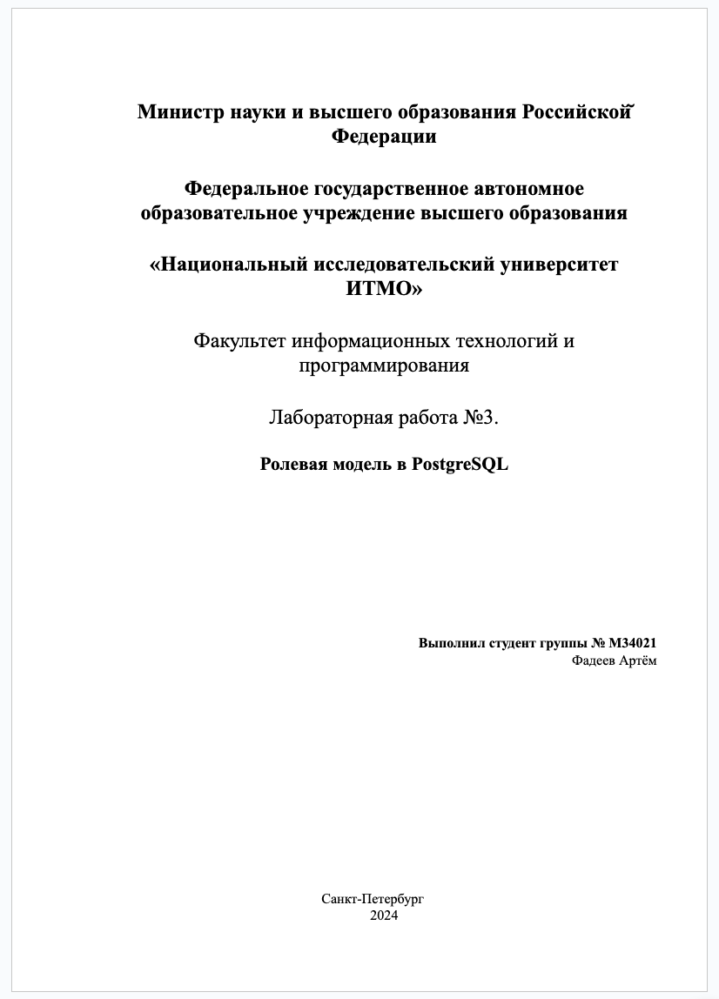

## Цель работы

- ознакомиться с концепцией ролей для управления разрешениями на доступ к объектам СУБД PostgreSQL
- получить навыки разграничения доступа

## Результаты выполнения

```shell
make up && docker exec -it postgres /bin/bash -c "psql -U postgres"
```

```sql
create role artyom_fadeyev with login password 'artyom_fadeyev' nosuperuser;

create role itmo_users nologin nocreatedb nocreaterole nosuperuser;
create role itmo_readers nologin nocreatedb nocreaterole nosuperuser;

create role itmo_user_1 with login password 'itmo_user_1';
create role itmo_reader_1 with login password 'itmo_reader_1';

grant itmo_users to itmo_user_1;
grant itmo_readers to itmo_reader_1;

create database artyom_fadeyev_db with owner artyom_fadeyev;

\c artyom_fadeyev_db artyom_fadeyev

create table table_1
(
    id   serial primary key,
    name varchar(100)
);

insert into table_1 (name)
values ('name_1'),
       ('name_2'),
       ('name_3');

create table table_2
(
    id     serial primary key,
    income integer
);

insert into table_2 (income)
values (100),
       (200),
       (300);

revoke all on database artyom_fadeyev_db from group itmo_users, itmo_readers;
grant connect on database artyom_fadeyev_db to group itmo_users, itmo_readers;
grant select, insert, update, delete on all tables in schema public to itmo_users;
grant select on all tables in schema public to itmo_readers;

\c artyom_fadeyev_db itmo_user_1

-- insert is allowed for itmo_user_1
insert into table_1 (id, name)
values (4, 'name_4');

-- allowed to create and drop your own tables
create table table_3
(
    id   serial primary key,
    name varchar(100)
);

\c artyom_fadeyev_db itmo_reader_1

select *
from table_1;

-- insert is not allowed for itmo_reader_1
insert into table_1 (id, name)
values (5, 'name_5');

-- allowed to create and drop your own tables
create table table_4
(
    id     serial primary key,
    income integer
);
```

- Кто такой владелец БД и какими правами он обладает? В чем его отличие от суперпользователя.

> Владелец базы данных - это роль в PostgreSQL, которая имеет особые права на конкретную базу данных. Владелец имеет
> полный контроль над базой данных и может выполнять любые операции в пределах этой базы данных без каких-либо
> ограничений.
>
> Основное отличие между владельцем базы данных и суперпользователем заключается в том, что суперпользователь обладает
> всеми правами в системе управления базами данных PostgreSQL, включая управление всеми базами данных
> и пользователями, а также настройку и изменение самой системы PostgreSQL. В то время как владелец базы данных имеет
> права только на конкретную базу данных и не обладает полным контролем над всей системой.

- Может ли одна роль иметь доступ к нескольким Базам Данных?

> Да, в PostgreSQL одна роль может иметь доступ к нескольким базам данных. Это может быть достигнуто путем назначения
> соответствующих разрешений этой роли на несколько баз данных. Таким образом, роль сможет выполнять операции в пределах
> всех баз данных, к которым ей был предоставлен доступ.

- В чем отличие пользовательской роли от групповой роли?

> Пользовательская роль в PostgreSQL - это роль, которая непосредственно связана с пользователем базы данных. Она
> определяет права и привилегии, доступные конкретному пользователю в базе данных.
>
> Групповая роль - это роль, которая может быть назначена одновременно нескольким пользователям. Это удобно, когда
> нескольким пользователям требуется иметь одинаковые права и привилегии в базе данных. Путем назначения пользователей в
> групповую роль можно избежать дублирования разрешений и упростить управление доступом.

### Вывод

В ходе выполнения лабораторной работы были изучены основные концепции ролевой модели в PostgreSQL, а также получены
навыки разграничения доступа к объектам базы данных с использованием ролей и привилегий.

Были созданы пользовательские роли, групповые роли, база данных, таблицы, а также были назначены соответствующие
разрешения и привилегии для этих ролей с последующей проверкой их корректности.